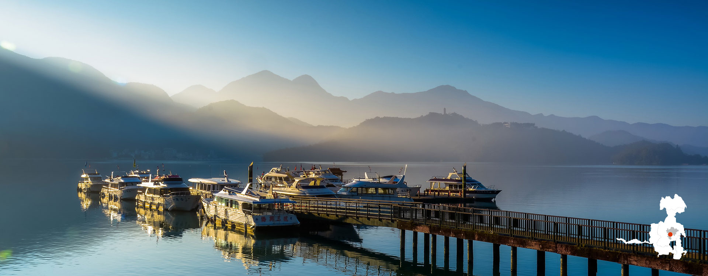

# Basics

## Easy Card (You probably want this)

The "EasyCard" is the subway, bus, and general-use spending card within Taipei.
It is probably best to purchase one at the airport after you land as it is required to board the purple subway line into Taipei.
If you do not purchase at the airport, or if you need to add funds, you can do so at any 7-11 or FamilyMart.

There are many designs for EasyCard (Pokemon, scenery, etc) and any card will work.
There is no functional difference between the cards.

When using your EasyCard, tap your card when boarding AND exiting the subway or bus.

* [More info](https://www.taipeitravelgeek.com/taiwan-easycard)

### Elayne's Opinion
She says you don't "need" an EasyCard and can instead buy one time coins to ride the subway.
I have no idea how this works, but it is apparently an option.

## Getting To Taiwan
* Fly into [TaoYuan airport](https://goo.gl/maps/aRemXSRMmD1zR36t6)
* Buy an Easy Card within the airport (see above)
* Take the purple subway line to Taipei

## Where to stay

Any hotel that is close to the MRT (Mass Rapid Transit), Taipei's transit system, should be fine.
It would be best to stay within Taipei City, NOT "New Taipei" or "New Taipei City".
Both "New" cities are further from the venue and may require additional transfers or a taxi ride.

Hotels are generally better than AirBnb rentals within Taipei.
Most anywhere within Taipei City will be within convenient walking distance (5-10 minutes) from the MRT or a bus stop.

## Getting Around Taipei
In order of convenience: 
1. walk
2. ride the subway
3. take the bus
4. ride youbike
5. take a taxi

Walking is easy and preferred as Taipei's thoroughfare's have wide sidewalks and clear signs.
If you choose to take the subway or bus, be sure to check your map ahead of time.
Google maps does not do a great job suggesting subway directions but does pretty well with the bus.
If you choose to get a youbike, you must first get a local phone number and sim card; [check here for more details](https://www.taipeitravelgeek.com/taipei-youbike).

* [Here is a big tourism map pdf](https://eng.taiwan.net.tw/att/files/Taiwan%20Tourist%20Map_1.pdf)

# Things To Do
## Sightseeing in Taipei
* [Taipei 101](https://goo.gl/maps/wuunWe75HxtyJkKr8)
    * most iconic building in Taiwan with a tour
    * shopping mall surrounds the building
* [National Palace Museum](https://goo.gl/maps/h5docatat5FdQm2i6)
    * massive museum
* [MaoKong (貓空) Gondola](https://goo.gl/maps/UFUe4YX7bN1bTF7t8)
    * public transit gondola to top of mountain overlooking Taipei
    * drink tea in the mountain
* [Taiwan Beer Brewery](https://goo.gl/maps/TjLRXDXwdHQGZyEv6)
    * classic taiwan beer
    * the linked location is the entrance to the beer garden, the brewery takes up the whole block
* Night Markets
    * search google for the one closest to you, walk there, and buy what looks good

## Hiking
There are many trails near Taipei and around the island.

Here are a few hikes within Taipei:
* [JianTan Mountain](https://goo.gl/maps/Gb8NQkr9F4JQGnm4A)
* [Bailusishan Trail](https://goo.gl/maps/DMQNDc4iB5nymqYu9)
* [HuShan Trail](https://goo.gl/maps/cmtqAJ1HG4cYoWKw6)

More Info:
* [Tourism PDF guide](https://eng.taiwan.net.tw/att/files/Easy%20Hiking_%E9%9B%BB%E5%AD%90%E6%9B%B8-%E5%B7%B2%E5%A3%93%E7%B8%AE.pdf)

## Travel Around The Island

From Taipei, nearly every destination can be reached via train from [Taipei Main Station](https://goo.gl/maps/ysSXqhir3KvXbshSA).
High Speed trains go along the west side of the island and regular trains go along the east side.

Rental cars are possible with an international passport, but trains are preferred.
Note that Taipei Main Station is on top of, and surrounded by, a massive underground mall.
It can be easy to get lost within this mall; if this happens, follow the signs to head up to ground level.

* [Tourism site's guide to HSR](https://eng.taiwan.net.tw/m1.aspx?sNo=0029047)

# Places outside Taipei

There are many amazing places inside and outside Taipei, almost any place you go will be great.

The next largest cities: Taichung, Kaohsiung, Tainan are all on the western side of the island.
These places are major urban cities and have similar amenities to Taipei but, with the exception of Kaohsiung, lack a subway system.
Should you plan to visit these cities, plan other modes of transportation in advance.

One recommended tour is [this 5-day tour](https://edisontours.com/regular-sightseeing/5-day-best-of-taiwan-sun-moon-lake-tarako-gorge-kaohsiung-taitung/) which stops at most of the locations below. You can also view [the same tour (with photos) on TripAdvisor](https://www.tripadvisor.com/AttractionProductReview-g13808515-d11468189-5_Day_Best_of_Taiwan_Sun_Moon_Lake_Tarako_Gorge_Kaohsiung_Taitung-Xinyi_District.html).

## [Sun Moon Lake](https://goo.gl/maps/Ju8R6Bi8V79sdhPn7)

Iconic lake surrounded by mountains. This is a common tourist destination with plenty of hikes, shops, and places to relax.

## [Hualian](https://goo.gl/maps/8sebAEKf2zXtojAN9)

City on the eastern side of Taiwan with mountains and beaches.
Easily accessed by a train from Taipei.

Sights:
* [Taroko Gorge National Park](https://goo.gl/maps/VgAknD7Wg3RgwNCk6)

## [Kaohsiung](https://goo.gl/maps/qiMC9nLQCLmQkALT9)

Kaohsiung and Tainan are two southern cities that are accessible via the HSR (High Speed Rail).
If you have not ridden HSR before, I would recommend it. The ride is fast, smooth, and comfy.

Near the train station is [Zuoying Lotus Pond](https://goo.gl/maps/iGCbFWqHdM5Tsjqn9) which is surrounded by tourist attractions.

### Elayne's Opinion

Elayne says that one of the best places to visit in Kaohsiung is [National Sun Yat-sen University](https://goo.gl/maps/CdZNSYairr2Gy7vMA). There are many things to see here including [the old British Consulate](https://goo.gl/maps/SqpLu4Dk2HHvrp5V9), but I'd argue the best reason is that there are monkeys. If you visit this area monkeys may try to steal your food.

# Cultural Notes
## Toilets
There are toilets in all subway stations and you do not need to pay to use toilets there.

When using public toilets be sure to bring tissue paper as it is not guaranteed to be provided.
Toilet paper has started to be provided within Taipei and major transportation hubs but it should not be expected.

[Squatting toilets](https://en.wikipedia.org/wiki/Squat_toilet) are common.
Most tourist locations have sitting toilets ("normal" toilets).

## Alchohol
Alchohol is sold at any convenience store (such as 7-11) and can be consumed anywhere.
Drinking is less common, but it is becoming more common, so you may not find "bars" as you are accustomed to.

## It will rain
Not so much a cultural note, but bring an umbrella (or get wet).
